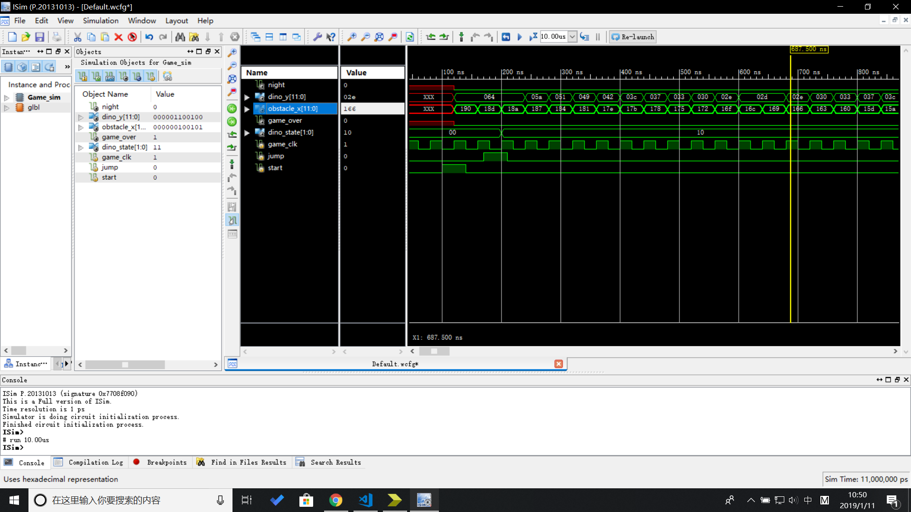
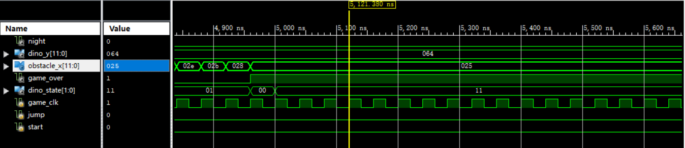

# fpga-dinosaur
A replica of Chrome Dino on FPGA
## 背景介绍
如果你不知道小恐龙游戏的话，请打开电脑中的Chrome浏览器，在地址栏中输入chrome://dino/，然后按空格体验游戏。而我们的这个项目是一个运行在FPGA上的同款小恐龙游戏。为了维护世界和平和防止小恐龙的灭绝，玩家需要控制小恐龙的跳跃来躲避路径上的仙人掌，玩家坚持的时间越久，分数越高。随着游戏的进行，仙人掌的运动速度会越来越快直到一个峰值。游戏场景会发生白天黑夜的变化让游戏变得更cooooooooool。
## 设计说明
A. 设计开发环境  

    实验平台：SWORD  
    开发环境：Xilinx ISE  
    硬件描述语言：Verilog  
B. 输入输出交互选择  

    输入：按钮、拨动开关  
    输出：调用四位 7 段数码管,LED,VGA   

## 操作说明
这个项目有两个外界输入，一个是SWORD最左侧的开关（AF10），用于控制游戏开始，另一个是矩阵按钮中的最左下角那个（V18，W16），用于控制跳跃。刚programme完毕之后显示的是没有game_over但是游戏暂停的状态，拨动开始开关（要置回0）可以开始游戏。按下跳跃按钮小恐龙会跳跃，以躲避障碍物。数码管的分数会随着时间递增。当小恐龙撞上障碍物后游戏会暂停，LED全亮表明game_over，计分板暂停计分。此时如果想重新开始需要再拨动开关，此时分数会清零，游戏状态会重置。
## 核心模块说明
* Top  

        1.输入：  
        input clk：系统时钟信号  
        input rstn：重置输入（本来想用但是没用到）  
        input [15:0]SW：15个开关输入  
        input wire BTN：一个按钮输入  

        2.输出：  
        output wire LED[7:0]：8个LED输出  
        output hs：VGA水平同步输出  
        output vs：VGA垂直同步输出  
        output [3:0] r：VGA红色输出  
        output [3:0] g：VGA绿色输出  
        output [3:0] b：VGA蓝色输出  
        output wire BTNX4：按钮使能    
        output wire [3:0]AN：Arduino子板数码管使能  
        output wire [7:0]Segment：Arduino子板数码管段码输出

        3.图（截RTL那个好了）  

        4.调用所有模块，将Game模块生成的状态输出到数码管和vga上  
* Game  

        1.输入：  
        input wire game_clk：游戏时钟  
        input wire jump：跳跃信号  
        input wire start：开始信号

        2.输出：  
        output reg night：白天夜晚输出  
        output reg [11:0] dino_y：恐龙中心y位置输出  
        output reg signed [11:0] obstacle_x：障碍物x位置输出  
        output reg game_over：游戏失败信号  
        output reg [1:0] dino_state：恐龙状态  

        3.图（截RTL那个好了）

        4.以时钟输入作为游戏时钟，根据parameters.v中的游戏参数控制游戏元素的状态。根据输入的start信号控制游戏的开始和重置，根据输入的jump信号控制小恐龙的跳跃。维护小恐龙的竖直速度以完成完整的跳跃过程。判断小恐龙和仙人掌的碰撞以输出game_over。对游戏始终计数来控制白天黑夜以及小恐龙运动状态的变化。
* vga  
* Renderer  

        1.输入：   
        input wire [11:0] dino_y：来自Game的恐龙y信号
        input wire [1:0] dino_state：来自Game的恐龙状态信号
        input wire [11:0] obstacle_x：来自Game的障碍物x位置信号
        input wire night：来自Game的白天夜晚信号
        input pixel_clk：像素绘制时钟
        input [11:0] vga_x：当前像素位置X
        input [11:0] vga_y：当前像素位置Y
        2.输出：
        output reg pixel：当前像素是否点亮，点亮为1

        3.图（截RTL那个好了）

        4.负责根据地面、小恐龙、障碍物的位置，给出每一个像素点的颜色。小恐龙、仙人掌的图像由几个常值矢量（ROM）保存，通过计算当前像素与它们位置的相对位置，来判断是不是在图像范围内，以及需不需要点亮像素。
* DispNum  
* Score  
* Parameters.v

        提供控制游戏的所有参数（常量），便于优化操作体验。还保存了小恐龙、仙人掌的二值位图，它们是通过一个自制的图像二值采样脚本得到的。你可以通过退后一点、摘掉眼镜、观察编辑器（VS Code）缩略图等方式看到图像。
## 核心模块模拟仿真时序图
* Game模块开始及跳跃  
可以看到game模块的输出obstacle_x再开始后每一个游戏时钟周期减1，开始跳跃后输出dino_y以抛物线的方式变化。

* Game模块跳跃结束  
当小恐龙落回地面后，dino_y停止变化，结束跳跃状态，可以注意到小恐龙在水平移动时dino_state不断切换。

* Game模块游戏失败  
发生碰撞后游戏停止，输出game_over为1，表明游戏失败。
  
## 组内成员及工作说明
## 验证过程  
(图片1)  
（图片2）  
{图片3}  
《图片四》  
放几张图片。详细过程见视频。
